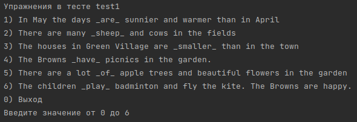

# Описание проекта

## Общие сведения
Приложение для тестирования по английскому языку.  
Авторизация происходит по логину пользователя.  
Если введен незарегистрированный логин, система предлагает создать нового пользователя с заданным именем. 
Тестовая система представляет собой набор тестов, каждый из которых включает в себя несколько упражнений, предлагающих вставить пропущенное слово или фразу в предложение. 
Добавлять и удалять тесты может администратор.  

## Используемые библиотеки

- h2 2.1.214
- jackson 2.13.4

## Запуск программы

1. Перед запуском программы необходимо создать и запустить базу данных H2
2. Запустить программу через класс **ru.croc.project.Init**.  
    В качестве аргументов необходимо передать:      
   - URL базы данных
   - имя пользователя БД
   - пароль пользователя БД
   - путь к SQL-скрипту (**/WorkDirectories/init.sql**)  

    Таким образом будут созданы необходимые таблицы в БД. 
    Также будет зарегистрирован пользователь с логином **"admin"** и правами администратора. 
    Данное действие необходимо делать только 1 раз после создания БД
3. Запустить программу через класс **ru.croc.project.Main**/ (аргументы командной строки такие же,
как и в для **ru.croc.project.Init**, только без SQL-скрипта).

### Структура полученной БД:

## Пример запуска программы
### Начало:

### Главное меню:

### Добавить тест:
Тут необходимо ввести путь до JSON-файла.  
  
Пример JSON-файла: **/WorkDirectories/test1.json**  
В JSON-файле указываются:
- Название теста
- Массив заданий

Каждое задание включает в себя:
- Предложение с пропущенным словом, замененным на "_"
- Массив вариантов ответов
- Номер правильного варианта ответа (начиная с 0)

### Список тестов:
Тут выводится список загруженных тестов:  
  
При выборе тесте выводится меню действий над тестом:  
  
__Список заданий__:  
  
При выборе задания:  
  
При выборе экспорта в CSV-файл, тест экспортируется в рабочую директорию, название файла соответствует названию теста.  
### Статистика пользователей:
При выборе данного пункта выводится список пользователей, доступных в системе.  
  
При выборе пользователя выводится список пройденных тестов с результатами.  
  
При выборе теста выводится отчет по каждому заданию теста  
  
### Начать тестирование:
При выборе данного пункта пользователю предлагается выбрать тест из доступных  
  
После выбора теста поочереди начинают появляться задания из выбранного теста  
  
После окончания теста выводятся результаты  
  
По желанию пользователь может посмотреть статистику по пройденному тесту  
  
### Добавление нового пользователя
Если при входе введено незарегистрированное имя пользователя, система предложит создать нового пользователя.  
  
Пользователи добавленные таким образом не обладают параметрами администратора, и их главное меню выглядит так  
  
Статистика для обычного пользователя отображается также, как и для администратора

